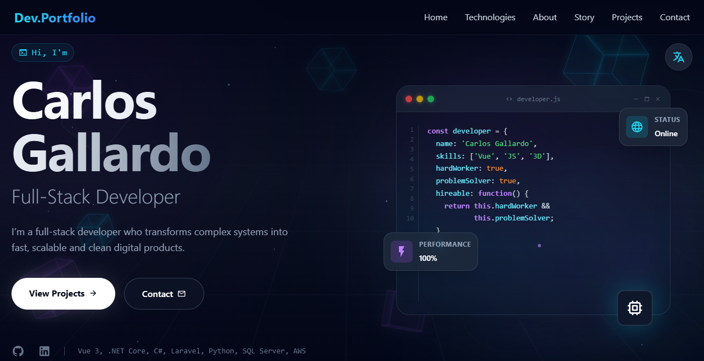

# 🚀 Carlos Gallardo — Full-Stack Developer Portfolio

A modern, high-performance developer portfolio built with **Vue 3**, **Vite**, **TailwindCSS**, and deployed on **Vercel** with a custom domain at **carlosgallardo.dev**.

This portfolio showcases my work, skills, and experience as a **Full-Stack Developer specializing in .NET Core + Vue.js**, with a strong focus on performance, UI/UX, animations, and clean architecture.

---

## 🌐 Live Demo

**🔗 [https://www.carlosgallardo.dev](https://www.carlosgallardo.dev)**

---

## 📸 Preview



---

## ✨ Features

* ⚡ **100% Lighthouse SEO Score**
* 🎨 **Hero section with smooth animations (GSAP/Motion)**
* 🧩 **Reusable UI components**
* 📱 **Fully responsive design**
* 🧠 **Modern and clean UX/UI design**
* 🚀 **Optimized for speed and scalability**
* 📊 **Projects showcased with case-study structure**
* 🌙 **Dark theme aesthetic with neon accents**
* 🔍 **Vercel Analytics integrated**

---

## 🛠️ Tech Stack

### **Frontend**

* Vue 3 (Composition API)
* Vite
* TailwindCSS
* Motion / GSAP (animations)

### **Backend (Skills demonstrated in projects)**

* .NET Core 8
* C#
* SQL Server / PostgreSQL

### **Other Tools**

* Vercel (deployment)
* Cloudflare DNS + SSL
* GitHub (version control)
* Figma (UI design)

---

## 📁 Project Structure

```text
📦 portfolio
 ┣ 📂 public
 ┣ 📂 src
 ┃ ┣ 📂 components
 ┃ ┣ 📂 sections
 ┃ ┣ 📂 assets
 ┃ ┗ 📜 main.js
 ┣ 📜 index.html
 ┣ 📜 tailwind.config.js
 ┣ 📜 package.json
 ┗ 📜 README.md
```

---

## 🧑‍💻 About Me

I’m a **Full-Stack Developer** who transforms complex systems into fast, scalable, and clean digital products. My work blends:

* Modern UI/UX
* Strong backend architecture
* Performance-driven mentality
* Animated and engaging interfaces

I specialize in **modernizing ERPs**, building **data-driven dashboards**, and creating **high-impact landing pages**.

---

## ⭐ Key Skills

* .NET Core + C#
* Vue 3 + JavaScript
* Python
* SQL Server & PostgreSQL
* TailwindCSS
* Animations (GSAP / Motion)
* API development
* Clean architecture
* Cloud deployments (Vercel)

---

## 📬 Contact

If you're looking for a developer who combines technical execution with polished UI/UX and speed:

**📧 Email:** [cagr_14@hotmail.com](mailto:cagr_14@hotmail.com.com)

**🔗 Portfolio:** [https://www.carlosgallardo.dev](https://www.carlosgallardo.dev)

**🔗 LinkedIn:** [https://linkedin.com/in/carlos-gallardo-dev](https://linkedin.com/in/carlos-gallardo-dev)

---

## 📝 License

This project is open source and available under the **MIT License**.

---

## ❤️ Acknowledgments

Thanks for checking out my portfolio! Feel free to reach out if you want to collaborate, hire, or just talk tech.
